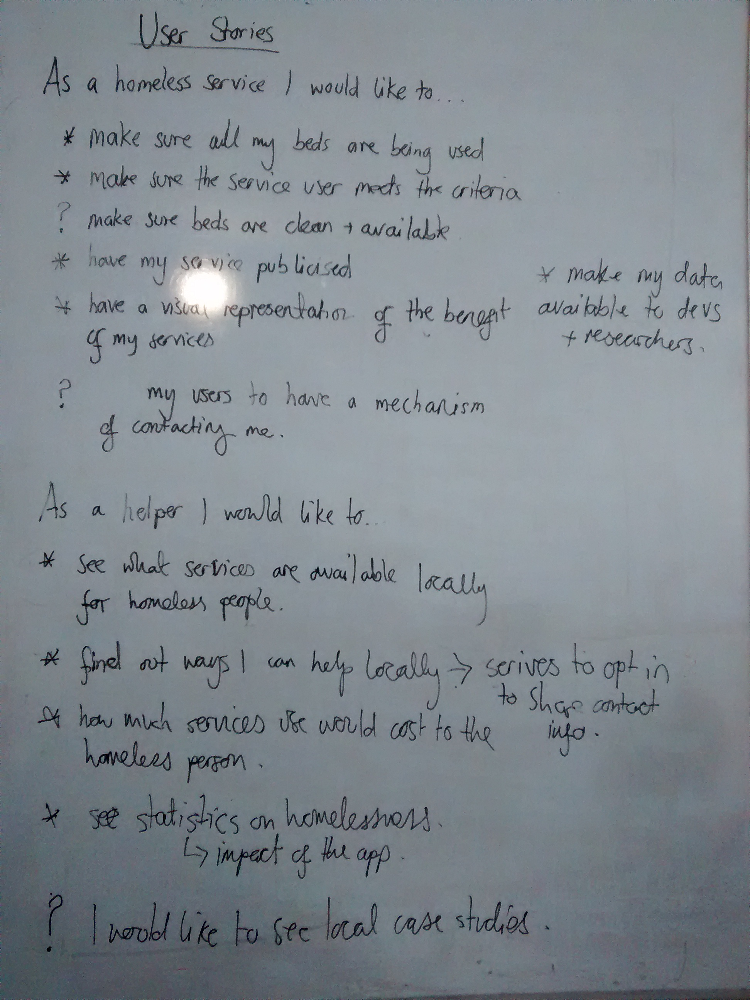
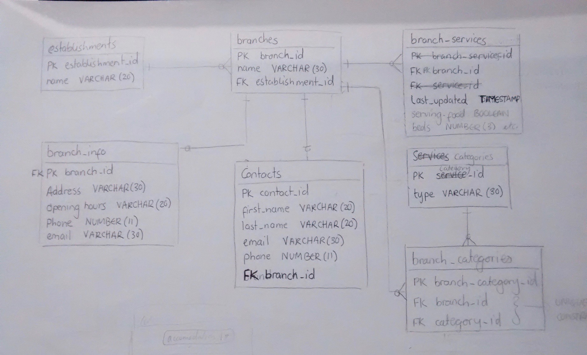

# homeless-services-app

```
GET    /api/provider/{name?}
POST   /api/provider/{name?}
DELETE /api/provider/{name?}

GET    /api/branch?radius=...&lat=...&lng=...&services=...
GET    /api/branch/{name?}
POST   /api/branch/{name?}
DELETE /api/branch/{name?}

GET    /api/branch/{name?}/address
POST   /api/branch/{name?}/address

GET    /api/branch/{name?}/services
POST   /api/branch/{name?}/services

GET    /api/branch/{name?}/contacts
POST   /api/branch/{name?}/contacts

GET    /api/category/{name?}
POST   /api/category/{name?}

POST   /api/private/sms
```

# User Stories



# Database

## Schema


